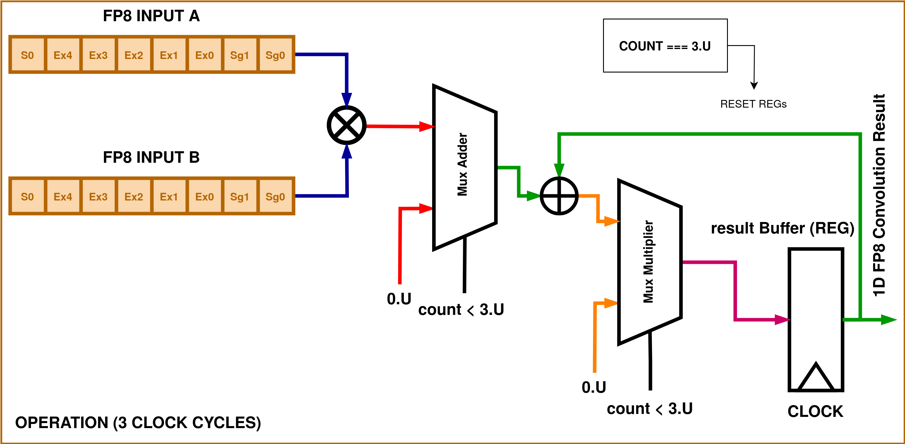

<!---

This file is used to generate your project datasheet. Please fill in the information below and delete any unused
sections.

You can also include images in this folder and reference them in the markdown. Each image must be less than
512 kb in size, and the combined size of all images must be less than 1 MB.
-->

## Design 

The digital block comprises of two sub blocks and a top module that incorporates a MAC (multiply-and-accumulate) operation.

This IEEE 754 format for a 8-bit FP precision for addition and multiplication is implemented. The operations incorporate intricacies and corner cases for handling +/- inf, NaN, Zeros and a full 8-bit precision range. 

| Details of FP8  | Binary Formats |
| :-----------: | :------------: |
|Exponent Bias| 15 |
|Infinites| S.11111.00_2|
|||
|||
|||
|||
|||
|||
|||

This format is highly limited in precision and range compared to standard floating-point formats like IEEE 754 single-precision (32-bit) or double-precision (64-bit). It would likely be used in specialized scenarios where memory is at a premium or where precision beyond this level is unnecessary.

## How to test

Run `make` in the `/test` directory.

## External hardware

None required! The design is combinational, requiring only a small buffer to store the current CRC value. As a result, it's quite simple.
